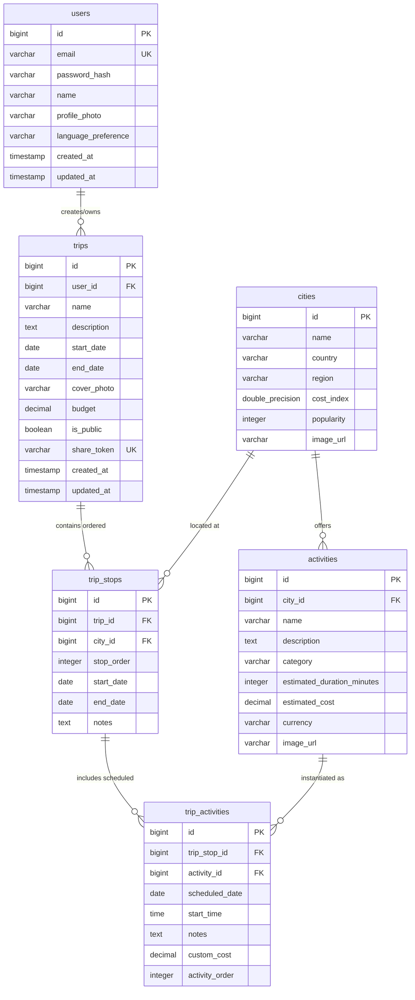

# GlobeTrotter — Database Design & Schema

> **Document Status**: Relational Schema Specification (Phase 8 Audited)  
> **Source of Truth**: Flyway Migrations (V1 to V6) & Entity Model  

---

## 1. Relational ER Diagram

---

## 2. Entity Specifications & Field Dictionary

### 2.1 `users` Table (`V1__create_users_table.sql`)
- **Primary Key**: `id` (`BIGSERIAL` / `BIGINT`)
- **Fields**:
  - `id`: Unique user identifier
  - `email`: User email address (`VARCHAR(255)`, `UNIQUE`, `NOT NULL`)
  - `password_hash`: BCrypt encrypted password hash (`VARCHAR(255)`, `NOT NULL`)
  - `name`: Display name (`VARCHAR(100)`, `NOT NULL`)
  - `profile_photo`: Profile photo URL (`VARCHAR(500)`, `NULL`)
  - `language_preference`: Preferred language code e.g., 'en' (`VARCHAR(10)`, `DEFAULT 'en'`)
  - `created_at`: Account creation timestamp (`TIMESTAMP`)
  - `updated_at`: Modification timestamp (`TIMESTAMP`)

### 2.2 `trips` Table (`V2__create_trips_table.sql`, `V5__add_budget_to_trips.sql`, `V6__add_trip_sharing.sql`)
- **Primary Key**: `id` (`BIGSERIAL` / `BIGINT`)
- **Foreign Keys**: `user_id` -> `users(id)` (`ON DELETE CASCADE`)
- **Fields**:
  - `id`: Unique trip identifier
  - `user_id`: Owner user ID (`BIGINT`, `NOT NULL`)
  - `name`: Title of the trip e.g., "Goa Vacation 2026" (`VARCHAR(150)`, `NOT NULL`)
  - `description`: Overview text of travel plan (`TEXT`, `NULL`)
  - `start_date`: Overall trip start date (`DATE`, `NOT NULL`)
  - `end_date`: Overall trip end date (`DATE`, `NOT NULL`)
  - `cover_photo`: Optional cover photo URL (`VARCHAR(500)`, `NULL`)
  - `budget`: Configured trip budget (`DECIMAL(12,2)`, `NULL`)
  - `is_public`: Public itinerary toggle status (`BOOLEAN`, `NOT NULL`, `DEFAULT FALSE`)
  - `share_token`: Unpredictable UUID share token (`VARCHAR(100)`, `UNIQUE`, `NULL`)
  - `created_at`: Record creation timestamp (`TIMESTAMP`)
  - `updated_at`: Record modification timestamp (`TIMESTAMP`)

### 2.3 `cities` Table (`V3__create_cities_and_trip_stops.sql`)
- **Primary Key**: `id` (`BIGSERIAL` / `BIGINT`)
- **Fields**:
  - `id`: Unique city identifier
  - `name`: City name (`VARCHAR(100)`, `NOT NULL`)
  - `country`: Country name (`VARCHAR(100)`, `NOT NULL`)
  - `region`: Region / Continent (`VARCHAR(100)`, `NOT NULL`)
  - `cost_index`: Relative cost rating scale (`DOUBLE PRECISION`, `NOT NULL`, `DEFAULT 1.0`)
  - `popularity`: Popularity score index (`INTEGER`, `NOT NULL`, `DEFAULT 50`)
  - `image_url`: City photo URL (`VARCHAR(500)`, `NULL`)

### 2.4 `trip_stops` Table (`V3__create_cities_and_trip_stops.sql`)
- **Primary Key**: `id` (`BIGSERIAL` / `BIGINT`)
- **Foreign Keys**:
  - `trip_id` -> `trips(id)` (`ON DELETE CASCADE`)
  - `city_id` -> `cities(id)` (`ON DELETE RESTRICT`)
- **Fields**:
  - `id`: Unique stop identifier
  - `trip_id`: Associated trip (`BIGINT`, `NOT NULL`)
  - `city_id`: Selected city (`BIGINT`, `NOT NULL`)
  - `stop_order`: Sequential position order (`INTEGER`, `NOT NULL`)
  - `start_date`: Stop start date (`DATE`, `NOT NULL`)
  - `end_date`: Stop end date (`DATE`, `NOT NULL`)
  - `notes`: Custom notes (`TEXT`, `NULL`)

### 2.5 `activities` Table (`V4__create_activities_and_trip_activities.sql`)
- **Primary Key**: `id` (`BIGSERIAL` / `BIGINT`)
- **Foreign Keys**: `city_id` -> `cities(id)` (`ON DELETE CASCADE`)
- **Fields**:
  - `id`: Unique activity identifier
  - `city_id`: Associated city ID (`BIGINT`, `NOT NULL`)
  - `name`: Title of activity (`VARCHAR(150)`, `NOT NULL`)
  - `description`: Activity description (`TEXT`, `NULL`)
  - `category`: Category e.g., 'ADVENTURE', 'CULTURE', 'SIGHTSEEING' (`VARCHAR(50)`, `NOT NULL`)
  - `estimated_duration_minutes`: Estimated duration in minutes (`INTEGER`, `NOT NULL`, `DEFAULT 60`)
  - `estimated_cost`: Baseline cost estimate (`DECIMAL(10,2)`, `NOT NULL`, `DEFAULT 0.00`)
  - `currency`: Currency code (`VARCHAR(10)`, `DEFAULT 'USD'`)
  - `image_url`: Activity image URL (`VARCHAR(500)`, `NULL`)

### 2.6 `trip_activities` Table (`V4__create_activities_and_trip_activities.sql`)
- **Primary Key**: `id` (`BIGSERIAL` / `BIGINT`)
- **Foreign Keys**:
  - `trip_stop_id` -> `trip_stops(id)` (`ON DELETE CASCADE`)
  - `activity_id` -> `activities(id)` (`ON DELETE RESTRICT`)
- **Fields**:
  - `id`: Unique scheduled trip activity instance ID
  - `trip_stop_id`: Parent trip stop (`BIGINT`, `NOT NULL`)
  - `activity_id`: Referenced activity (`BIGINT`, `NOT NULL`)
  - `scheduled_date`: Date scheduled (`DATE`, `NOT NULL`)
  - `start_time`: Scheduled time (`TIME`, `NULL`)
  - `notes`: User custom notes (`TEXT`, `NULL`)
  - `custom_cost`: Custom cost override (`DECIMAL(10,2)`, `NULL`)
  - `activity_order`: Display sequence order (`INTEGER`, `NOT NULL`)

---

## 3. Database Indexes & Constraints

- `idx_trips_share_token`: Unique index on `trips(share_token)` for fast public itinerary resolution.
- `fk_trips_user`: Foreign key linking `trips.user_id` to `users.id` with `ON DELETE CASCADE`.
- `fk_trip_stops_trip`: Foreign key linking `trip_stops.trip_id` to `trips.id` with `ON DELETE CASCADE`.
- `fk_trip_activities_stop`: Foreign key linking `trip_activities.trip_stop_id` to `trip_stops.id` with `ON DELETE CASCADE`.
